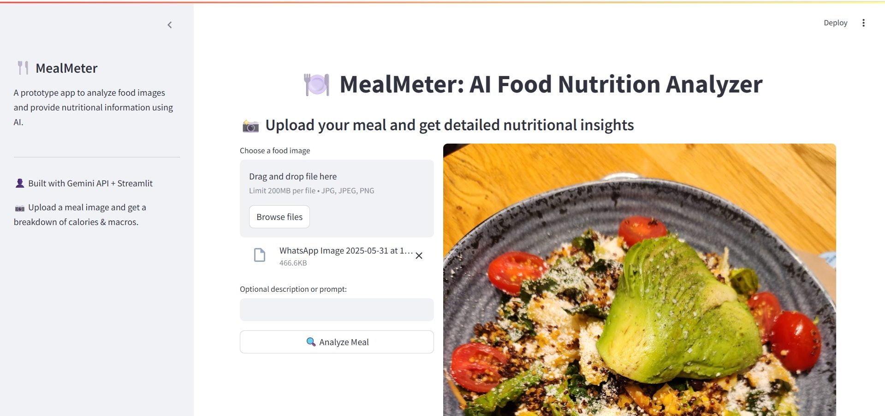

# MealMeter: AI-Powered Nutrition Insights

## Overview

MealMeter is an innovative application that leverages the power of Large Language Models (LLMs), Gemini, and GenAI to provide users with detailed nutritional insights about their meals. Built using Python and Streamlit, this app allows users to upload images of their meals and receive personalized analysis.

## Key Features

* **Meal Analysis**: Upload an image of your meal and receive detailed nutritional insights, including macronutrient breakdowns and calorie estimates.
* **AI-Powered**: Our app utilizes cutting-edge LLMs, Gemini, and GenAI to provide accurate and reliable nutritional analysis.
* **User-Friendly Interface**: Our clean and intuitive interface makes it easy to navigate and analyze your meals.

## Tech Stack

* **Python**: The backbone of our application, providing a robust and scalable framework for building our app.
* **Streamlit**: A powerful library for building interactive and user-friendly interfaces.
* **LLMs**: Leveraging the latest advancements in Large Language Models to provide accurate and reliable nutritional analysis.
* **Gemini**: Utilizing Gemini's capabilities to enhance our app's performance and accuracy.
* **GenAI**: Harnessing the power of GenAI to provide personalized and insightful nutritional analysis.

## How it Works

1. **Upload Your Meal**: Simply upload an image of your meal to our app.
2. **Analyze Your Meal**: Our AI-powered engine analyzes the image and provides detailed nutritional insights.
3. **Get Insights**: Receive personalized recommendations and analysis to help you make informed decisions about your diet.

## Screenshots

## Getting Started

To run this project locally, follow these steps:

1. Clone the repository: `git clone https://github.com/abhaskaran/meal_meter.git`
2. Install dependencies: `pip install -r requirements.txt`
3. Run the app: `streamlit run app.py`

## Contributing

We welcome contributions to MealMeter! If you'd like to contribute, please fork the repository and submit a pull request.

## License

This project is licensed under the [MIT License](https://opensource.org/licenses/MIT).